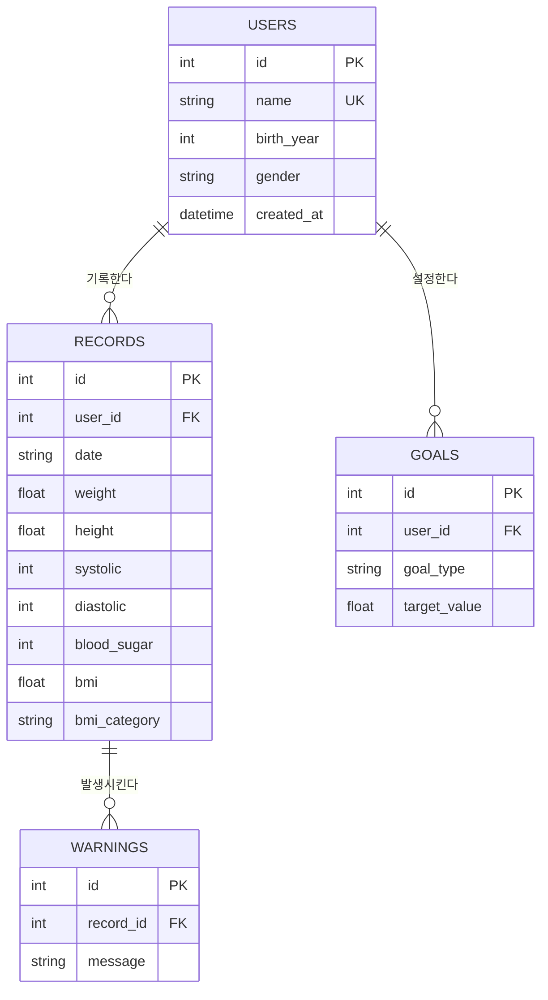

# 마이 헬스 로그 API

매일의 건강 수치(몸무게·키·혈압·혈당)를 기록하면, 서버가 BMI를 자동 계산하고 건강 상태를 분류하며, 경고와 통계를 제공하는 REST API입니다.

> 기획 문서: [간단 PRD](PRD.md) · [정식 PRD](PRD_full.md)

> 이 프로젝트의 건강 분류 기준은 학습용으로 단순화한 값이며, 실제 의학적 진단이 아닙니다.

## 두 가지 버전

이 저장소에는 두 버전이 있습니다.

| 버전 | 저장 방식 | 실행 파일 | 설명 |
|------|----------|----------|------|
| v1 (과제 제출본) | JSON 파일 | `main.py` | 과제 요구사항 구현 |
| v2 (확장) | SQLite DB | `main_db.py` | ERD 설계 기반 DB 전환 |

### v1 실행 (파일 기반)
```
pip install -r requirements.txt
uvicorn main:app --reload
```
접속: http://127.0.0.1:8000/docs

### v2 실행 (SQLite 기반)
```
pip install -r requirements.txt
python init_db.py                        # 최초 1회: DB 및 테이블 생성
uvicorn main_db:app --reload --port 8001
```
접속: http://127.0.0.1:8001/docs

### v2에서 추가된 것
- **사용자 테이블 분리**: 이름 대신 user_id로 연결 (1:N 관계)
- **경고 별도 테이블**: 기록당 여러 경고를 정규화하여 저장
- **다중 목표**: goal_type으로 체중·혈압 등 여러 목표 관리
- **SQL 집계**: COUNT/AVG/MIN/MAX로 통계 계산
- **JOIN**: 조회 시 사용자 이름 함께 반환

## 기능 (엔드포인트)

| 메서드 | 경로 | 설명 |
|--------|------|------|
| POST | /records | 건강 기록 추가 (BMI·분류·경고 자동 계산) |
| GET | /records | 전체 기록 조회 (개수 포함) |
| GET | /records/{id} | 기록 하나 조회 (없으면 404) |
| PUT | /records/{id} | 기록 수정 (재계산) |
| DELETE | /records/{id} | 기록 삭제 |
| GET | /search | 날짜 범위(start, end)로 검색 |
| GET | /stats | 평균 체중·BMI 등 통계 |
| GET | /weekly-report | 최근 7일 평균과 지난주 대비 변화 |
| POST · GET | /goal | 목표 체중 설정 및 달성률 조회 |
| GET | /records?user= | 사용자별 전체 기록 조회 |
| GET | /stats?user= | 사용자별 통계 |
| GET | /search?user=&start=&end= | 사용자별 날짜 범위 검색 |

## 추가 기능 (가점)

- **간단 웹 화면**: 브라우저에서 기록을 입력·조회할 수 있는 HTML 페이지 제공 (`/` 접속)
- **걸음 수 등급**: 하루 걸음 수로 활동량 등급(부족/적정/우수) 자동 분류
- **수면 분석**: 수면 시간을 권장 기준과 비교해 분류(부족/적정/과다)
- **주간 리포트**: 최근 7일 평균 체중과 지난주 대비 변화 제공 (`GET /weekly-report`)
- **목표 관리**: 목표 체중을 설정하고 현재 체중과의 차이(달성률) 제공 (`POST /goal`, `GET /goal`)
- **사용자 구분**: user 필드로 사용자별 기록·통계·목표를 분리 관리

## 분류 기준

- **BMI**: 18.5 미만 저체중 / 18.5~22.9 정상 / 23~24.9 과체중 / 25 이상 비만
- **혈압**: 정상 / 주의 / 고혈압
- **공복혈당**: 정상 / 공복혈당장애 / 당뇨 의심

## ERD (v2 데이터베이스 설계)



### Docker 실행
docker build -t health-log-api .
docker run -p 8000:8000 health-log-api

접속: http://127.0.0.1:8000/docs

> Docker 실행은 v1(파일 기반)을 대상으로 합니다.